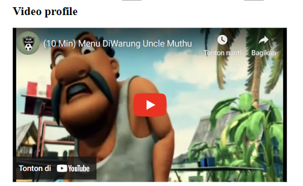
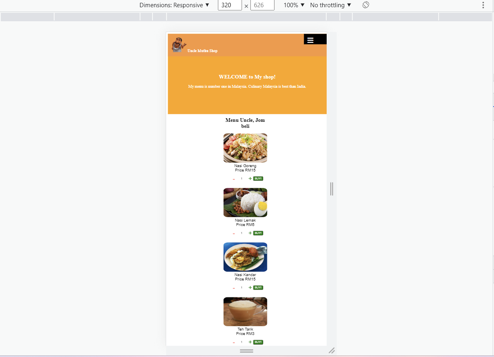

[](https://classroom.github.com/a/6H2sAzcR)

# TUGAS WEEK-2
Saya membuat website resposive tentang Food E-commers. Goal pada tugas ini antara lain:

Website ini support resolusi 1440px(dekstop)-320px(mobile).
## Header Website

Header ini memiliki beberapa element antara lain:

1.Icon website - gambar uncle muthu<br>2.Judul website - saya pake tag b (supaya fontnya bold)<br>3.Beberapa Icon(mail,cart-shop,magnifying-glass)<br>4.image untuk photo profile<br><br>
## Body Website

Pertama Halaman selamat datang.Ini saya pakai H2 dan p.H2 untuk Welcome to my Shop! sedangkan p untuk penjelasan makananya dan promosi. Saya pakai flex terus di flex-direction: coloumn kemudian di justify-content: center kemudian diberi warna orange. berikut codenya.
``` 
.halaman-welcome{
    text-align: center;
    color: white;
    background-color: orange;
    height: 320px;
    display: flex;
    flex-direction: column;
    justify-content: center;
    padding-top: 48px;
}
```
Kemudian Menu "Uncle, Jom beli" saya mengunakan element p. Untuk Menu-menunya saya kelompokan per-section Kemudian penjelasan nama menu dan harga. Saya taruh di articel.Berikut codenya.
```
<section class="all-menu">
        <article>

<p>Nasi Goreng<br>Price RM15</p>
<div class="form-pembelian">
<div class="jumlah-pesanan">
<button class="kurangi-pesanan">-</button> 
<input id="pesan-nasgor" type="text" aria-valuemin="1" aria-valuemax="100" role="spinbutton" value="1" placeholder="Brp?"></input>
<button class="tambah-pesanan">+</button>  
        </div>
    <button class="tombol-beli" type="button">BUY!</button>
        </div>
</article>
    <article>

<p>Nasi Lemak<br>Price RM5</p>
<div class="form-pembelian">
<div class="jumlah-pesanan">
<button class="kurangi-pesanan">-</button> 
<input id="pesan-nasi-lemak" type="text" aria-valuemin="1" aria-valuemax="100" role="spinbutton" value="1" placeholder="Brp?"></input>
<button class="tambah-pesanan">+</button>  
</div>
<button class="tombol-beli" type="button">BUY!</button>
        </div>
            </article>
```
Untuk gambarnya bisa langsung space kebawah saya pakai flex-warp. Kemudian agar bisa rapih saya pakai margin di buttom pembelian.<br>Button pembelian, menurut saya masih kurang rapih. Pertama saya membuat border luarnya dahulu. kemudian saya isi dengan button minus, input(text), button plus, dan button untuk submit.Berikut codenya.
```
<div class="form-pembelian">
            <div class="jumlah-pesanan">
                <button class="kurangi-pesanan">-</button> 
                <input id="pesan-nasi-kandar" type="text" aria-valuemin="1" aria-valuemax="100" role="spinbutton" value="1" placeholder="Brp?"></input>
                <button class="tambah-pesanan">+</button>  
               </div>
               <button class="tombol-beli" type="button">BUY!</button>
            </div>
```
untuk cssnya
```
.form-pembelian{
    align-items: center;
    border: solid 1px transparent;
    display: flex;
    align-content: flex-start;
    padding: 3px;
    margin: 10px 27px 20px;
}
.kurangi-pesanan{
    border-color: transparent;
    font-weight: bolder;
    background: transparent;
    color: red;
}
.tambah-pesanan{
    background: transparent;
    border-color: transparent;
    color: green;
    font-weight: bolder;
}
/* Tombol Submit per makanan (id) */
#pesan-nasgor{
    text-align: center;
    height: 100%;
    width: 50px;
    background: transparent;
    border-color: transparent;
}
```
Kemudian ada video profile terkait uncle muthu. Saya pakai element source kemudian diemmbed link videonya.<br>

Kemudian ada form pendaftaran yang berisi<br>
1.Nama<br>2.Birth date<br>3.Email<br>4.Pertanyaan"apakah kamu tinggal di Malaysia<br>5.Pertanyaan "Kenapa kamu tertarik join ke shop kami"<br>6.Submmit CV<br>7.Pertanyaan apakah yang kamu isi sudah benar?<br>8.Button Submit<br><br>
Berikut Gambar formnya.<br>

Saya pakai fieldshet dengan lengendnya sendiri. Nama, saya pakai input type text. birthday date, saya pakai input date. Email, Saya menggunakan input type email. Kemudian apakah kamu tinggal di Malaysia? Jawaban saya  pakai input type radio dengan jawaban yes atau no. Kemudian untuk pertanyaan kenapa kamu tertarik join? jawabannya saya pakai text area. Penyisipan file CV saya pakai input type file /.pdf (format pdf). Pertanyaan terakhir jawabannya saya pakai checkbox. Terakhir button submit. formnya saya pakai display flex kemudian flex-direction: coloumn kemudian justify-content: center.

## RESPONSIVE 
saya buat dua media query max-width 1440px dan max-width 320px.Codingannya bisa dilihat direpository saya.Berikut screenshotnya.
### Dekstop

Screeshot website resolusi 1440px

Screenshot website resolusi 1024px
### Tablet

Screenshot website resolusi 768px
### Mobile

Screenshot website resolusi 425px

Screenshot website 320px

## Menu Bar

Hover on

Hover off

# Link WEBSITE
snazzy-stroopwafel-ec31cf.netlify.app

